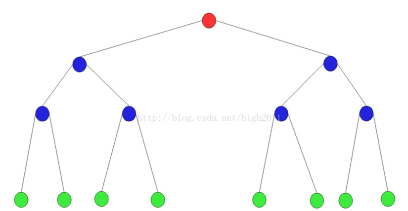
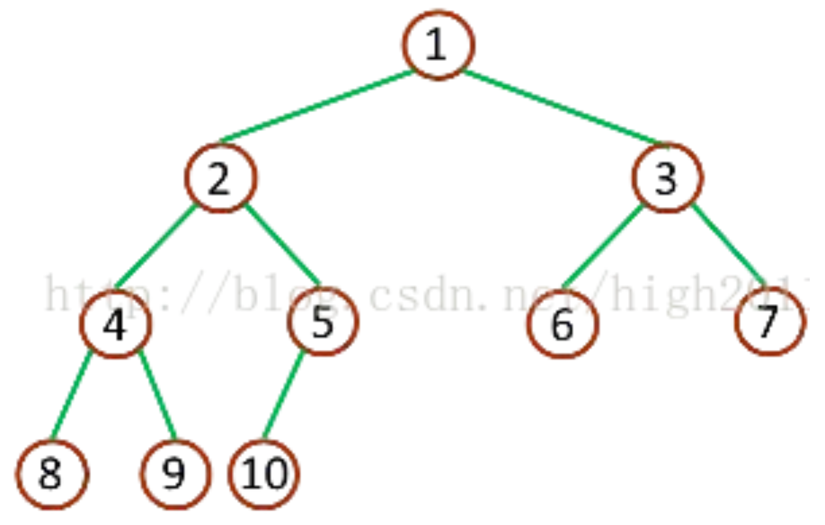
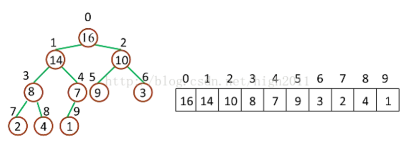
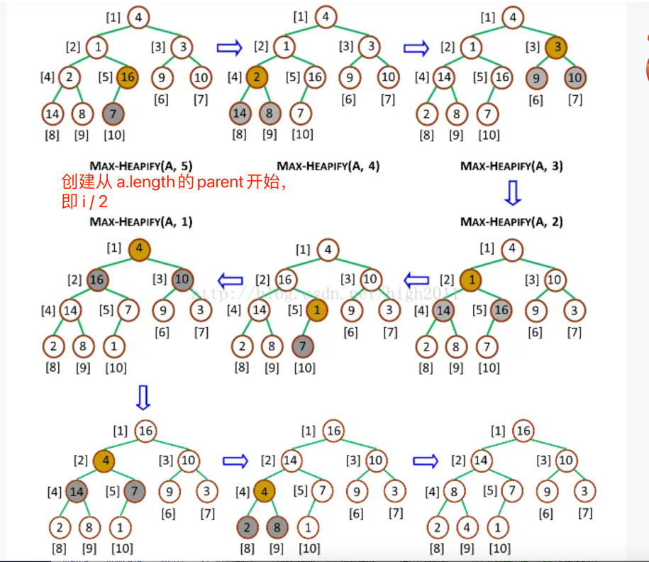
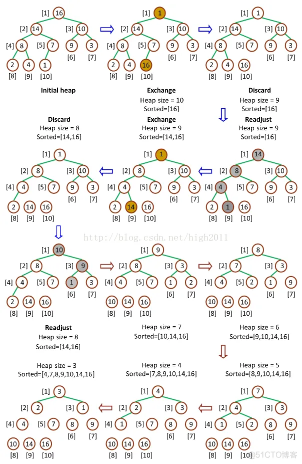

# 基础
## 二叉树
二叉树（英语：Binary tree）在计算机科学中，二叉树是每个节点最多有两个子树的树结构。通常子树被称作“左子树”（left subtree）和“右子树”（right subtree）。
二叉树常被用于实现二叉查找树和二叉堆。
### 树和二叉树的三个主要差别：
- 树的结点个数至少为 1，而二叉树的结点个数可以为 0
- 树中结点的最大度数没有限制，而二叉树结点的最大度数为 2
- 树的结点无左、右之分，而二叉树的结点有左、右之分

二叉树又分为完全二叉树（complete binary tree）和满二叉树（full binary tree）

满：深度为k，且节点数=2k

完全二叉树：深度为 k，有 n 个节点的二叉树，当且仅当其每一个节点都与深度为 k 的满二叉树中序号为 1 至 n 的节点对应时，称之为完全二叉树

# 堆排序

## 二叉堆
堆（二叉堆）可以视为一棵完全的二叉树，完全二叉树的一个“优秀”的性质是，除了最底层之外，每一层都是满的，这使得堆可以利用数组来表示（普通的一般的二叉树通常用链表作为基本容器表示），每一个结点对应数组中的一个元素。

对于给定的下标，有以下公式：

PS: 数组从1起始的情况
parent(i) = i / 2 [整数位]

left_child(i) = 2 * i

right_child(i) = 2 * i + 1

如果数组从Zero-based
公式需调整：
- parent(i) = (i - 1) / 2
- left_child(i) = 2 * i + 1
- right_child(i) = 2 * (i + 1)

如下图：

### 二叉堆分类
二叉堆一般分为两种：最大堆和最小堆。

最大堆：
- 最大堆的最大元素在根结点（堆顶）
- 堆中每个父节点的元素值都大于等于其孩子结点

最小堆：
- 最小堆的最小元素值在根结点（堆顶）
- 堆中每个父节点的元素值都小于等于其孩子结点

## 堆排序原理
堆排序就是把最大堆堆顶的最大数取出，将剩余的堆继续调整为最大堆，再次将堆顶的最大数取出，这个过程持续到剩余数只有一个时结束。

在堆中定义以下几种操作：

- 最大堆调整（Max-Heapify）：将堆的末端子节点作调整，使得子节点永远小于父节点，保证最大堆性质
- 创建最大堆（Build-Max-Heap）：将堆所有数据重新排序，使其成为最大堆
- 堆排序（Heap-Sort）：移除位在第一个数据的根节点，并做最大堆调整的递归运算

### 最大堆调整
传入parent, 数组，根据parent计算 parent\left\right哪个最大，并
swap替换，再递归调用最大的index做为parent继续调整

### 创建最大堆

### 堆排序
堆排序（Heap-Sort）是堆排序的接口算法，Heap-Sort先调用Build-Max-Heap将数组改造为最大堆，然后将堆顶和堆底元素交换，之后将底部上升，最后重新调用Max-Heapify保持最大堆性质。由于堆顶元素必然是堆中最大的元素，所以一次操作之后，堆中存在的最大元素被分离出堆，重复n-1次之后，数组排列完毕。整个流程如下图：

pop出index[0]即最大的值，剩余的重新调整为最大堆

